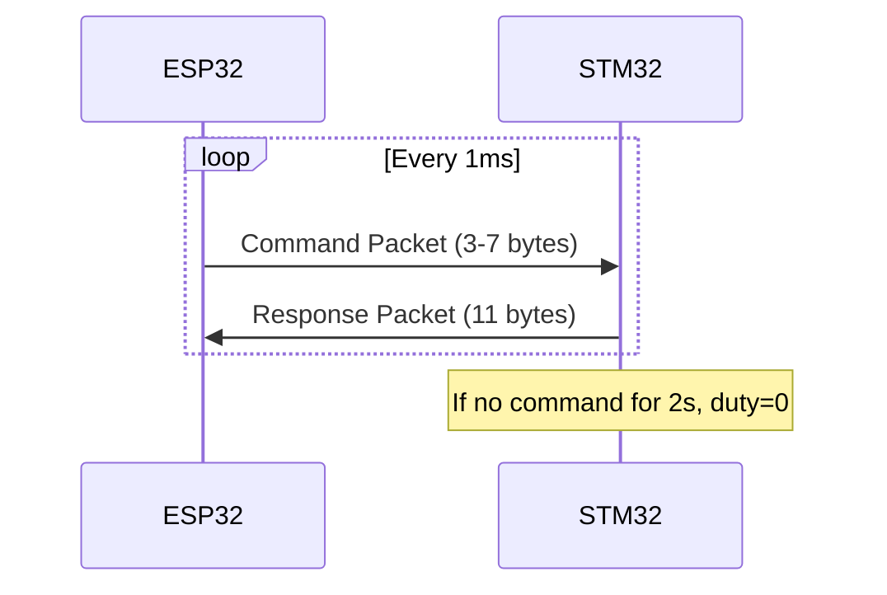

# UART Communication Protocol for BLDC Controller

## Protocol Overview

A request/response binary protocol where ESP32 sends commands and STM32 replies with position/velocity. At 921600 baud, each 18-byte max exchange takes ~0.2ms, comfortably supporting 1kHz.




## Design Principles

**Keep it simple:**

- Few files - protocol code inline in `main.c` and `main.cpp`, no separate protocol library
- Few helper functions - prefer inline code over abstractions
- No classes/structs beyond what's necessary - raw byte manipulation is fine
- Small and fast to change - optimize for iteration speed, not "clean architecture"

**Build environment:**

- STM32: PlatformIO environment `pennyesc` (not `calibration`)
- ESP32: PlatformIO environment `adafruit_qtpy_esp32s3_n4r2`

**Debugging:**

- Use Python 3.11 scripts for UART debugging/testing
- Connect via USB-serial adapter or ESP32 passthrough mode
- Simple `pyserial` scripts to send commands and parse responses
```python
# Example debug script (python 3.11)
import serial
import struct

ser = serial.Serial('/dev/cu.usbmodem*', 921600, timeout=0.1)

def poll():
    ser.write(bytes([0xAA, 0x03, 0x07]))  # START, CMD_POLL, CRC
    resp = ser.read(11)
    if len(resp) == 11 and resp[0] == 0xAA:
        pos, vel = struct.unpack('<ii', resp[2:10])
        print(f"Pos: {pos*0.01:.2f} rad, Vel: {vel*0.01:.1f} rad/s")
```


## Units

All angles in **centiradians (0.01 rad ≈ 0.57°)** for consistency:| Field | Type | Unit | Range | Notes ||-------|------|------|-------|-------|| Position | int32 | centiradians | ±21 million rad | ±3.4 million revolutions || Velocity | int32 | centiradians/second | ±21 million rad/s | ±200 million RPM (effectively unlimited) || Duty | int16 | raw PWM | -799 to +799 | Maps to timer compare value |

- 1 revolution = 628 centiradians (2π × 100)
- 20,000 RPM = 2094 rad/s = 209,400 centirad/s (fits easily in int32)

## Packet Format

### Command Packet (ESP32 to STM32)

| Byte | Field | Description ||------|-------|-------------|| 0 | Start | 0xAA || 1 | Cmd | 0x01=SetPosition, 0x02=SetDuty, 0x03=Poll || 2-3 or 2-5 | Payload | int16 (duty) or int32 (position) || Last | CRC8 | CRC-8/CCITT (polynomial 0x07) |

- **SetPosition (0x01)**: 4-byte payload (int32 centiradians), 7 bytes total
- **SetDuty (0x02)**: 2-byte payload (int16, -799 to +799 for PWM), 5 bytes total
- **Poll (0x03)**: No payload, 3 bytes total

### Response Packet (STM32 to ESP32)

| Byte | Field | Description ||------|-------|-------------|| 0 | Start | 0xAA || 1 | Status | Flags (bit0=position_reached, bit1=error) || 2-5 | Position | int32 centiradians (multi-turn absolute) || 6-9 | Velocity | int32 centiradians/second || 10 | CRC8 | CRC-8/CCITT |Total: **11 bytes** response.

## Multi-Turn Position Tracking

Modify the STM32 estimator to track absolute position across revolutions:

```c
// In main.c - replace single-turn angle with multi-turn
// 1 revolution = 2π rad × 100 = 628 centiradians
#define PI_CRAD 314         // π in centiradians
#define TWO_PI_CRAD 628     // 2π in centiradians

static int32_t absolute_position_crad = 0;  // centiradians, multi-turn
static int32_t last_angle_crad = 0;

void update_absolute_position(float angle_rad) {
    int32_t current_crad = (int32_t)(angle_rad * 100.0f);
    int32_t delta = current_crad - last_angle_crad;
    
    // Handle wraparound (detect >π radian jumps)
    if (delta > PI_CRAD) delta -= TWO_PI_CRAD;
    if (delta < -PI_CRAD) delta += TWO_PI_CRAD;
    
    absolute_position_crad += delta;
    last_angle_crad = current_crad;
}
```


## Position Control Logic

Simple bang-bang control toward target position:

```c
// In STM32 main loop
#define POSITION_DEADBAND_CRAD 5  // ~3 degrees deadband (5 crad = 0.05 rad = 2.9°)

if (target_position_set) {
    int32_t error = target_position_crad - absolute_position_crad;
    if (error > POSITION_DEADBAND_CRAD) {
        // Spin forward at set duty cycle
        pwm_duty = commanded_duty;
        direction = 1;
    } else if (error < -POSITION_DEADBAND_CRAD) {
        // Spin backward
        pwm_duty = commanded_duty;
        direction = -1;
    } else {
        pwm_duty = 0;  // Target reached
    }
}
```


## CRC-8 Implementation

**STM32 (hardware CRC)** - The STM32L0 CRC peripheral supports 8-bit mode:

```c
// Uses libopencm3: crc_common_all.c and crc_v2.c already in L0 Makefile
#include <libopencm3/stm32/crc.h>

void crc8_init(void) {
    rcc_periph_clock_enable(RCC_CRC);
    crc_set_polysize(CRC_CR_POLYSIZE_8);
    crc_set_polynomial(0x07);  // CRC-8/CCITT
    crc_set_initial(0x00);
}

uint8_t crc8_calculate(uint8_t *data, uint8_t len) {
    crc_reset();
    for (uint8_t i = 0; i < len; i++) {
        CRC_DR8 = data[i];  // 8-bit access
    }
    return (uint8_t)CRC_DR;
}
```

**ESP32 (software CRC)** - Simple lookup table:

```cpp
static const uint8_t crc8_table[256] = { /* precomputed for poly 0x07 */ };
uint8_t crc8(const uint8_t *data, size_t len) {
    uint8_t crc = 0x00;
    while (len--) crc = crc8_table[crc ^ *data++];
    return crc;
}
```


## ESP32 Arduino Interface Example

Complete example showing how to interface with the BLDC controller:

```cpp
#include <Arduino.h>

// UART pins
#define BLDC_RX 12
#define BLDC_TX 13
#define BLDC_BAUD 921600

// Protocol constants
#define START_BYTE 0xAA
#define CMD_SET_POSITION 0x01
#define CMD_SET_DUTY 0x02
#define CMD_POLL 0x03

// CRC-8 lookup table (polynomial 0x07)
static const uint8_t crc8_table[256] PROGMEM = {
    0x00,0x07,0x0E,0x09,0x1C,0x1B,0x12,0x15,0x38,0x3F,0x36,0x31,0x24,0x23,0x2A,0x2D,
    0x70,0x77,0x7E,0x79,0x6C,0x6B,0x62,0x65,0x48,0x4F,0x46,0x41,0x54,0x53,0x5A,0x5D,
    0xE0,0xE7,0xEE,0xE9,0xFC,0xFB,0xF2,0xF5,0xD8,0xDF,0xD6,0xD1,0xC4,0xC3,0xCA,0xCD,
    0x90,0x97,0x9E,0x99,0x8C,0x8B,0x82,0x85,0xA8,0xAF,0xA6,0xA1,0xB4,0xB3,0xBA,0xBD,
    0xC7,0xC0,0xC9,0xCE,0xDB,0xDC,0xD5,0xD2,0xFF,0xF8,0xF1,0xF6,0xE3,0xE4,0xED,0xEA,
    0xB7,0xB0,0xB9,0xBE,0xAB,0xAC,0xA5,0xA2,0x8F,0x88,0x81,0x86,0x93,0x94,0x9D,0x9A,
    0x27,0x20,0x29,0x2E,0x3B,0x3C,0x35,0x32,0x1F,0x18,0x11,0x16,0x03,0x04,0x0D,0x0A,
    0x57,0x50,0x59,0x5E,0x4B,0x4C,0x45,0x42,0x6F,0x68,0x61,0x66,0x73,0x74,0x7D,0x7A,
    0x89,0x8E,0x87,0x80,0x95,0x92,0x9B,0x9C,0xB1,0xB6,0xBF,0xB8,0xAD,0xAA,0xA3,0xA4,
    0xF9,0xFE,0xF7,0xF0,0xE5,0xE2,0xEB,0xEC,0xC1,0xC6,0xCF,0xC8,0xDD,0xDA,0xD3,0xD4,
    0x69,0x6E,0x67,0x60,0x75,0x72,0x7B,0x7C,0x51,0x56,0x5F,0x58,0x4D,0x4A,0x43,0x44,
    0x19,0x1E,0x17,0x10,0x05,0x02,0x0B,0x0C,0x21,0x26,0x2F,0x28,0x3D,0x3A,0x33,0x34,
    0x4E,0x49,0x40,0x47,0x52,0x55,0x5C,0x5B,0x76,0x71,0x78,0x7F,0x6A,0x6D,0x64,0x63,
    0x3E,0x39,0x30,0x37,0x22,0x25,0x2C,0x2B,0x06,0x01,0x08,0x0F,0x1A,0x1D,0x14,0x13,
    0xAE,0xA9,0xA0,0xA7,0xB2,0xB5,0xBC,0xBB,0x96,0x91,0x98,0x9F,0x8A,0x8D,0x84,0x83,
    0xDE,0xD9,0xD0,0xD7,0xC2,0xC5,0xCC,0xCB,0xE6,0xE1,0xE8,0xEF,0xFA,0xFD,0xF4,0xF3
};

uint8_t crc8(const uint8_t* data, size_t len) {
    uint8_t crc = 0x00;
    while (len--) crc = pgm_read_byte(&crc8_table[crc ^ *data++]);
    return crc;
}

// Response structure
struct BLDCResponse {
    bool valid;
    uint8_t status;
    int32_t position_crad;   // centiradians
    int32_t velocity_crads;  // centiradians/second
    
    bool positionReached() { return status & 0x01; }
    bool hasError() { return status & 0x02; }
    float positionRad() { return position_crad * 0.01f; }
    float velocityRadS() { return velocity_crads * 0.01f; }
    float velocityRPM() { return velocity_crads * 0.001591549f; } // /(2π*100)*60
};

// Communication stats
struct {
    uint32_t sent = 0;
    uint32_t received = 0;
    uint32_t crcErrors = 0;
    uint32_t timeouts = 0;
    uint32_t latencyUs = 0;
    uint32_t latencyMaxUs = 0;
} stats;

// Send command and wait for response
BLDCResponse sendCommand(uint8_t cmd, const uint8_t* payload, uint8_t payloadLen) {
    BLDCResponse resp = {false, 0, 0, 0};
    uint32_t start = micros();
    
    // Build and send packet
    uint8_t txBuf[8];
    txBuf[0] = START_BYTE;
    txBuf[1] = cmd;
    memcpy(&txBuf[2], payload, payloadLen);
    txBuf[2 + payloadLen] = crc8(txBuf, 2 + payloadLen);
    Serial1.write(txBuf, 3 + payloadLen);
    stats.sent++;
    
    // Wait for response (11 bytes, timeout 5ms)
    uint8_t rxBuf[11];
    uint8_t rxIdx = 0;
    uint32_t timeout = millis() + 5;
    
    while (rxIdx < 11 && millis() < timeout) {
        if (Serial1.available()) {
            uint8_t b = Serial1.read();
            if (rxIdx == 0 && b != START_BYTE) continue;  // Resync
            rxBuf[rxIdx++] = b;
        }
    }
    
    if (rxIdx < 11) {
        stats.timeouts++;
        return resp;
    }
    
    // Verify CRC
    if (crc8(rxBuf, 10) != rxBuf[10]) {
        stats.crcErrors++;
        return resp;
    }
    
    // Parse response
    resp.valid = true;
    resp.status = rxBuf[1];
    memcpy(&resp.position_crad, &rxBuf[2], 4);
    memcpy(&resp.velocity_crads, &rxBuf[6], 4);
    stats.received++;
    
    // Update latency stats
    stats.latencyUs = micros() - start;
    if (stats.latencyUs > stats.latencyMaxUs) {
        stats.latencyMaxUs = stats.latencyUs;
    }
    
    return resp;
}

// High-level API functions
BLDCResponse setPosition(int32_t position_crad) {
    uint8_t payload[4];
    memcpy(payload, &position_crad, 4);
    return sendCommand(CMD_SET_POSITION, payload, 4);
}

BLDCResponse setDuty(int16_t duty) {
    uint8_t payload[2];
    memcpy(payload, &duty, 2);
    return sendCommand(CMD_SET_DUTY, payload, 2);
}

BLDCResponse poll() {
    return sendCommand(CMD_POLL, nullptr, 0);
}

// Convenience: set position in radians
BLDCResponse setPositionRad(float rad) {
    return setPosition((int32_t)(rad * 100.0f));
}

void setup() {
    Serial.begin(115200);  // USB debug
    Serial1.begin(BLDC_BAUD, SERIAL_8N1, BLDC_RX, BLDC_TX);
    
    Serial.println("BLDC Controller Ready");
}

void loop() {
    static uint32_t lastPollUs = 0;
    static uint32_t loopCount = 0;
    
    // Poll at 1kHz using micros() for precise timing
    uint32_t now = micros();
    if (now - lastPollUs >= 1000) {  // 1000µs = 1ms = 1kHz
        lastPollUs = now;
        loopCount++;
        
        BLDCResponse r = poll();
        
        // Print stats every 1000 loops (1 second at 1kHz)
        if (loopCount % 1000 == 0 && r.valid) {
            Serial.printf("Pos: %.2f rad, Vel: %.1f RPM | Latency: %lu/%lu us | Errs: %lu CRC, %lu TO\n",
                r.positionRad(), r.velocityRPM(), 
                stats.latencyUs, stats.latencyMaxUs,
                stats.crcErrors, stats.timeouts);
        }
    }
    
    // Example: spin motor with serial commands
    if (Serial.available()) {
        char c = Serial.read();
        if (c == 'f') setDuty(200);       // Forward
        if (c == 'r') setDuty(-200);      // Reverse  
        if (c == 's') setDuty(0);         // Stop
        if (c == 'p') setPositionRad(3.14159f);  // Go to π radians
        if (c == 'z') setPositionRad(0);  // Go to zero
        if (c == '?') {                   // Print full stats
            Serial.printf("Sent: %lu, Recv: %lu, CRC Err: %lu, Timeouts: %lu\n",
                stats.sent, stats.received, stats.crcErrors, stats.timeouts);
        }
    }
}
```


## 10kHz Encoder Sampling (Timer ISR Approach)

The TMAG5273 in continuous mode with 1x averaging at 1MHz I2C can achieve 10kHz reads. Using a timer ISR keeps the implementation simple and debuggable.

1. **Increase I2C to 1MHz** (TMAG5273 supports it):
   ```c
         I2C_TIMINGR(I2C1) = 0x00100109;  // ~1MHz Fast Mode Plus
   ```


2. **TMAG averaging set to 1x** for 10kHz fresh data:
   ```c
         tmag5273_write_reg(DEVICE_CONFIG_1, CONV_AVG_1X << CONV_AVG_SHIFT);
   ```


3. **Timer ISR at 10kHz** (TIM21 available on STM32L011):
   ```c
         // TIM21 configured for 10kHz interrupt (100µs period)
         void tim21_isr(void) {
             timer_clear_flag(TIM21, TIM_SR_UIF);
             tmag5273_read_xyt(&sensor);
             // angleLUT already returns radians
             float angle_rad = angleLUT_get_angle(sensor.x_raw, sensor.y_raw);
             update_absolute_position(angle_rad);
             update_commutation();
         }
   ```


4. **UART handling in main loop** (lower priority than encoder):
   ```c
         while(1) {
             if (uart_packet_available()) {
                 process_command();
                 send_response();
             }
             check_timeout();
         }
   ```


### TMAG Averaging vs Read Rate Tradeoff

| Averaging | Sensor Update Rate | 10kHz Reads | Notes ||-----------|-------------------|-------------|-------|| 1x | ~7.7kHz | Fresh data most reads | Default - best for commutation || 2x | ~3.8kHz | ~38% stale reads | Lower noise, some latency || 4x | ~1.9kHz | ~80% stale reads | Not recommended at 10kHz |**Recommendation:** Start with 1x averaging. The velocity estimator already filters noise. If angle jitter causes audible motor noise or erratic commutation, consider:

- Reducing ISR rate to 5kHz with 2x averaging (still fast enough for most motors)
- Adding software low-pass filter on angle readings
- Both approaches trade latency for noise reduction

## Detailed Timing Budget

### 10kHz Encoder ISR (100µs period)

| Task | Duration | Notes ||------|----------|-------|| I2C start + address | ~10µs | At 1MHz I2C || I2C read 4 bytes (X,Y) | ~32µs | 4 bytes × 8µs/byte || Angle LUT lookup | ~3µs | Table lookup + interpolation || Multi-turn position update | ~2µs | Integer math || Velocity estimation | ~3µs | Delta / dt || Commutation calc + GPIO | ~5µs | Step lookup + 3 GPIO writes || **ISR Total** | **~55µs** | **45% margin** |

### 1kHz UART Communication (1ms period)

| Task | Duration | Notes ||------|----------|-------|| RX max packet (7 bytes) | 76µs | 7 × 10 bits / 921600 || TX response (11 bytes) | 119µs | 11 × 10 bits / 921600 || Command parsing | ~5µs | Byte unpacking || CRC calculation (HW) | ~2µs | Hardware CRC peripheral || Response building | ~5µs | Byte packing || **UART Total** | **~207µs** | Per command/response cycle |

### Combined Timeline (1ms window)

```javascript
0µs     100µs    200µs    300µs    400µs    500µs    600µs    700µs    800µs    900µs   1000µs
|--ISR--|--ISR--|--ISR--|--ISR--|--ISR--|--ISR--|--ISR--|--ISR--|--ISR--|--ISR--|
   55µs    55µs    55µs    55µs    55µs    55µs    55µs    55µs    55µs    55µs  = 550µs

Main loop runs in gaps: 10 × 45µs = 450µs available
UART needs: ~207µs
Margin: ~243µs (24% idle)
```

The timer ISR preempts main loop every 100µs. UART bytes buffer in hardware FIFO during ISR execution.

## Safety Timeout (2 second watchdog)

```c
volatile uint32_t last_valid_cmd_time = 0;
#define COMM_TIMEOUT_MS 2000

void process_command(void) {
    // ... parse and execute command ...
    last_valid_cmd_time = system_millis;  // Reset watchdog
}

void check_timeout(void) {
    if ((system_millis - last_valid_cmd_time) > COMM_TIMEOUT_MS) {
        timer_set_oc_value(TIM2, TIM_OC4, 0);  // Duty = 0
        target_position_set = false;
    }
}
```


## Reboot Recovery

The protocol is stateless by design:

- STM32 boots with duty=0, no target set
- First valid command after boot just works
- No handshake required
- If ESP32 reboots mid-spin, STM32 timeout stops motor in 2s
- If STM32 reboots, ESP32's next command restarts control

## Benchmarking & Timing Verification

### STM32 Instrumentation

Expose timing stats via volatile debug variables (visible in MCUViewer/debugger):

```c
// Timing instrumentation
volatile uint32_t isr_duration_us = 0;      // Last ISR execution time
volatile uint32_t isr_max_us = 0;           // Max ISR time seen
volatile uint32_t isr_count = 0;            // Total ISR invocations
volatile uint32_t isr_overrun_count = 0;    // Times ISR exceeded 100µs
volatile uint32_t uart_rx_count = 0;        // Valid packets received
volatile uint32_t uart_crc_errors = 0;      // CRC failures

void tim21_isr(void) {
    uint32_t start = get_time_us();
    timer_clear_flag(TIM21, TIM_SR_UIF);
    
    // ... encoder read and commutation ...
    
    uint32_t elapsed = get_time_us() - start;
    isr_duration_us = elapsed;
    if (elapsed > isr_max_us) isr_max_us = elapsed;
    if (elapsed > 100) isr_overrun_count++;
    isr_count++;
}
```


### ESP32 Instrumentation

Track round-trip latency and packet statistics:

```cpp
struct CommStats {
    uint32_t packets_sent = 0;
    uint32_t packets_received = 0;
    uint32_t crc_errors = 0;
    uint32_t timeouts = 0;
    uint32_t latency_us = 0;        // Last round-trip time
    uint32_t latency_max_us = 0;    // Max round-trip seen
    uint32_t latency_avg_us = 0;    // Running average
} stats;

bool sendCommand(uint8_t cmd, const uint8_t* payload, uint8_t len) {
    uint32_t start = micros();
    // ... send packet ...
    // ... wait for response with timeout ...
    uint32_t elapsed = micros() - start;
    
    stats.latency_us = elapsed;
    if (elapsed > stats.latency_max_us) stats.latency_max_us = elapsed;
    stats.latency_avg_us = (stats.latency_avg_us * 7 + elapsed) / 8;  // EMA
    stats.packets_sent++;
    return true;
}
```


### Expected Benchmark Values

| Metric | Expected | Alarm Threshold ||--------|----------|-----------------|| ISR duration | ~55µs | >90µs || ISR max | <80µs | >100µs (overrun) || Round-trip latency | ~300µs | >800µs || CRC error rate | <0.01% | >1% |

### Debug Commands

Add a debug poll command (0xFE) that returns timing stats instead of position/velocity for diagnostics.

## File Changes

Keep everything inline - no new files, no protocol libraries.| File | Environment | Changes ||------|-------------|---------|| [src/main.c](pennyesc_libopencm3/src/main.c) | `pio run -e pennyesc` | Add UART protocol inline, multi-turn tracking, position control, CRC, timeout, timing instrumentation || [main.cpp](esp32s3demo/src/main.cpp) | `pio run -e adafruit_qtpy_esp32s3_n4r2` | Replace passthrough with protocol, CRC table, API functions inline |No changes needed to `platformio.ini` - CRC clock will be enabled in `main.c` with `rcc_periph_clock_enable(RCC_CRC)`.

## Byte Budget Summary