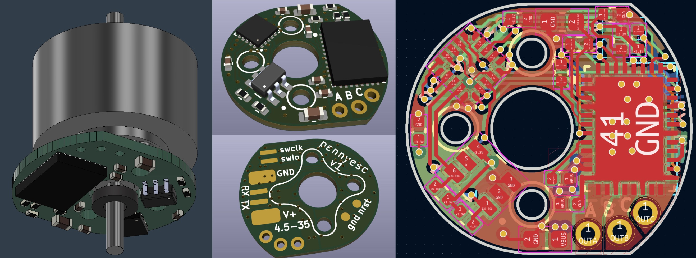
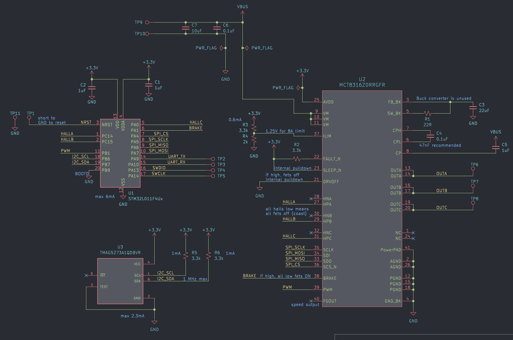
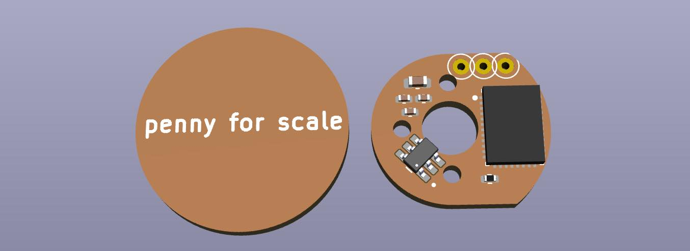
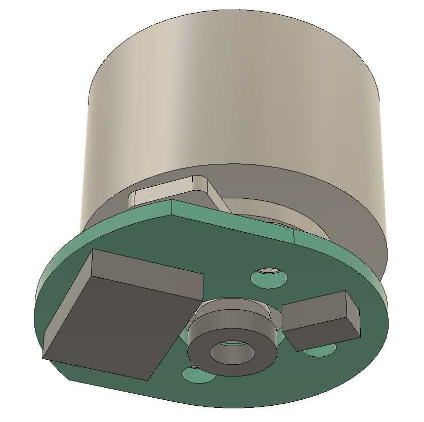
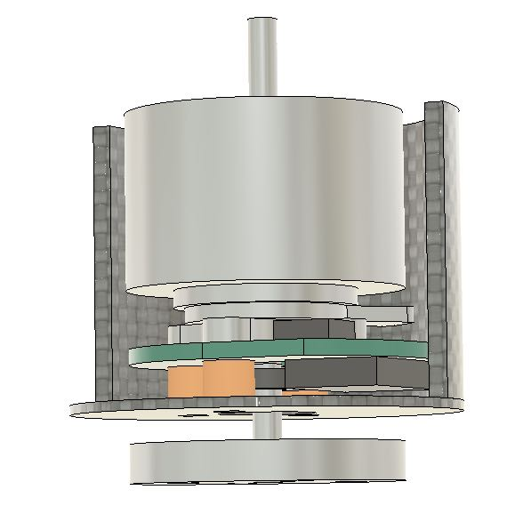
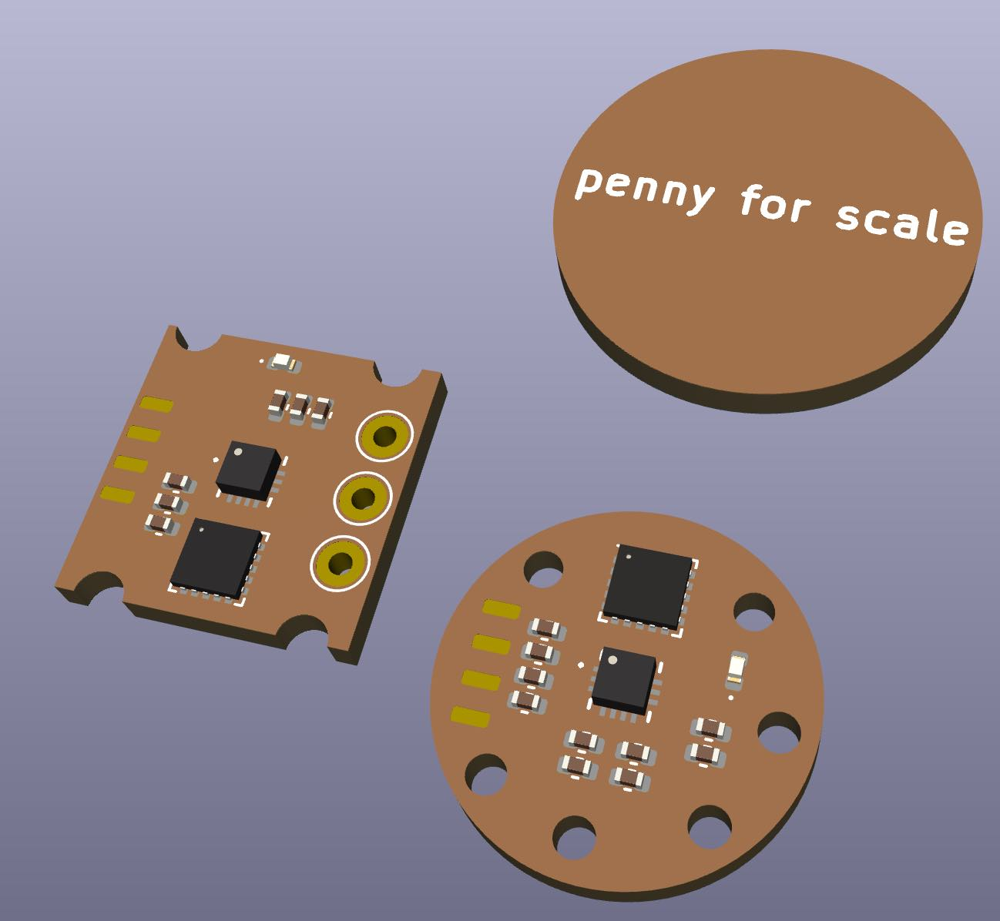

# PennyESC, a tiny and cheap brushless motor controller

## Nov 14
Finished layout and placed order with JLCPCB! Gerber, BOM, and CPL files in pennyesc/production/

Ended up being about $6/board for raw components, but after setup fees ($16), shipping ($39), and customs ($21) the total was $111 for 5 boards. It should be a lot better when ordering in larger quantities.

## Oct 28
Changed to TI TMAG5273 magnetic angle sensor and TI MCT8316Z power stage for lower price and higher current limit. Price for components should be around $8 per board from JLCPCB. Also thinking of using only 3 mounting holes and allowing for pass through shaft (off-axis magnet sensing). Pass through shaft could be useful for "floating motor" electric muscles.

 

## Oct 22

* Aiming for $10-15 component cost, around 15 mm diameter
* Assembled by JLCPCB using their in-stock parts
* MP6536 3-phase power stage ($3.38)
    * 5-26 V input
    * 5.5 A current limit
    * PWM input for each half-bridge
    * no current sense
    * 5x5 mm
* MA782 magnetic encoder ($4.11)
    * SPI
    * 2x2 mm
* STM32L011 microcontroller ($1.28)
    * 32 MHz clock
    * 3x3 mm
